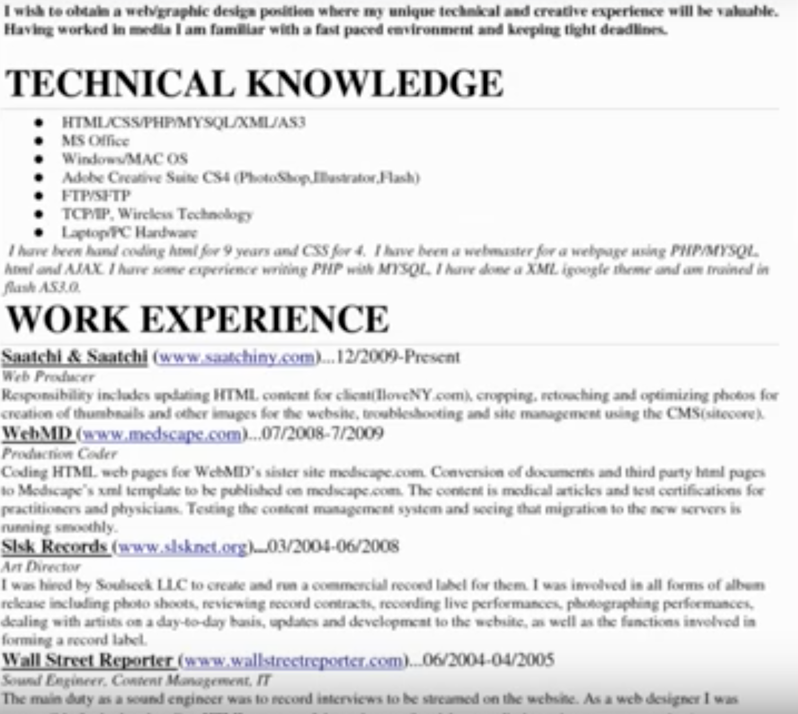

1. Resume template      
2. One page      
3. Include words from job description      
4. Include company name      
5. First working experience should reflect what they are looking for      
6. The job title is more important than company name unless the company name has a good recognition        
7. Online link in the beginning      
8. Remove the words "I"        
9. Do not describe how great you are      
10. Include action words describing what did you do and what was the result                      

        
      
        
       
